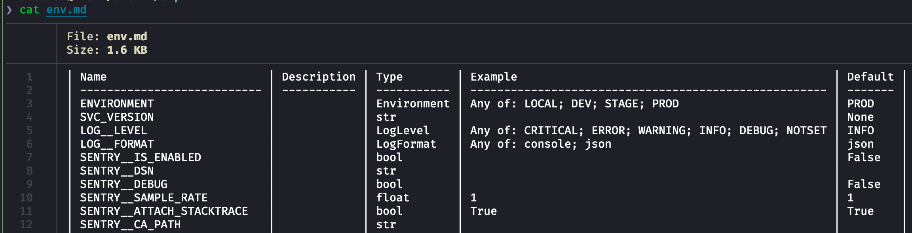

# Conf2env

Tool for convert from settings to comfortable markdown table. 

Support: enums, pydantic: nested models, env_prefix, env_nested_delimiter

Quickstart: 
1. `pip install conf2env`
2. `python -m conf2env {module}:{object} > env.md`

Example result:

More examples in [tests](./tests/conftest.py)

TODO:
- [ ] django
- [ ] simple-settings

